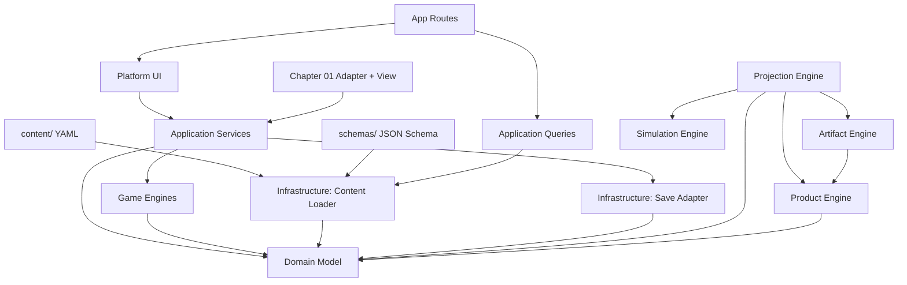

# Dependency Graph

Sprint 0.5 fixes the intended dependency direction for AI Product Quest.



The Product Engine builds a product out of the Event Log and runs the chapter's scenarios against
it. It is pure: the same configuration always yields the same readings, which is what lets a
rebuild be shown as a before/after rather than as two separate rolls. The Projection Engine layers
the six player-facing metrics on top of the full system state; nothing above it reads the twelve
raw fields.

## Allowed Direction

```text
UI → Application → Engines → Domain
UI → Application → Infrastructure
Infrastructure → Domain
Infrastructure → Application only when adapting legacy persistence
Content → Loader → Domain
```

## Guardrails

Automated checks live in `tests/architecture-boundaries.test.mts`.

They currently enforce:

- UI does not import `src/infrastructure`;
- Domain does not import application, engines, infrastructure, UI, or app routes;
- Domain does not use browser/runtime globals;
- Engines do not import UI, app routes, or infrastructure;
- `content/` stays data-only YAML;
- local source imports do not form cycles.

## Notes

`Chapter01Adapter` is allowed to be an adapter, but not an engine. If it starts accumulating branching rules, simulation, content constants, or projection logic, move that logic down into `src/application` or `src/engines`.
